# Create® 3 Educational Robot FAQs

## About the Create® 3 educational robot

### What is the Create® 3 educational robot?
The Create® 3 robot is a programmable robot based on the iRobot® Roomba® i3 vacuum robot.
Users can interact with this robot using ROS 2 or Python.
There have been three versions of the Create® robot series:

- The original Create® robot, released in 2007. This robot was based on the Roomba® Discovery series robots. It is all-white.
- The Create® 2 robot, released in 2014. This robot is based on the Roomba® 650 robot and includes a green faceplate marked with safe places to drill into the faceplate, once removed from the robot, to mount additional hardware.
- The Create® 3 robot, released in 2022. This robot is based on the Roomba® i3 robot and includes a translucent black faceplate and custom payload bay with holes for mounting.

----

### What age(s) is the Create® 3 educational robot designed for?
The Create® 3 educational robot is a STEM resource for educators, students, and developers.
It is an advanced platform intended for college and professional learners.

----

### How do I know the Create® 3 educational robot is right for me or my students?
The Create® 3 educational robot is an advanced STEM development platform intended for upper high school students, college students, or lifelong learners.
The Create® 3 robot exposes ROS 2[^1] nodes over Wi-Fi or via its USB-C[^2] host port.

----

## Getting Started with the Create® 3

### How do I set up the Create® 3 educational robot?

#### Part 1: Power on and Charge
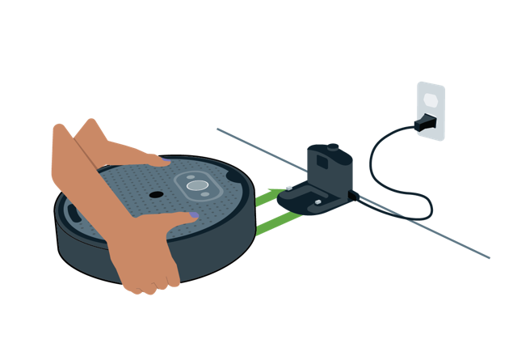
 
To power your robot on, plug your charging dock in and place the robot on the dock.
It may take your robot several minutes to charge.
While charging, the Create® 3 light ring will show a spinning, bright white light.
When fully charged, the light ring will glow a dim white.

#### Part 2: Update the Robot
a)	To ensure your robot is up to date, download the latest firmware package available [here](../../releases/overview/).
  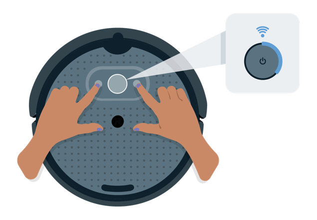  
b)	Press and hold Buttons 1 & 2 to activate your robot's hotspot.
When successful, your robot's light ring will show a spinning blue light.
  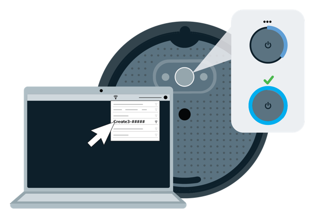  
c)	Open your computer's Wi-Fi manager and connect to your robot listed as Create-[xxx].
Once connected, your robot's light ring will show a solid cyan glow.
  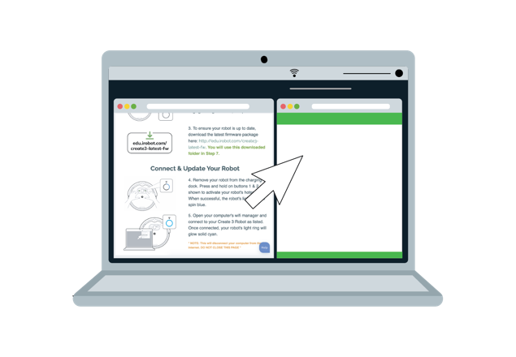  
d)	Once your computer is connected to your robot's Wi-Fi network, open a NEW internet browser window and navigate to: 192.168.10.1 (Note: This page is hosted on the Create 3 robot, so it will not need Internet access to open).
  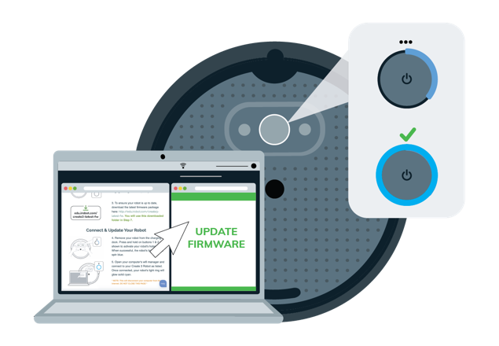  
e)	Navigate to the Update tab.
Follow the steps on the page to upload the firmware package downloaded in Step 1.
The Light Ring will spin white during the update.
Your robot's light may also turn red for a few minutes.
  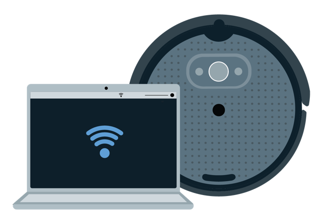  
f)	The light ring will glow solid white, and the robot will chime its happy sound when update is complete.
You may close the robot's hotspot page. Reconnect your computer to your default Wi-Fi network.

#### Part 3: Connect to Wi-Fi (ROS 2 Users)
  
a)	Re-open and connect to your robot's access point by repeating Steps 2-4 in “Part 2: Update the Robot” (above).
    
b)	If you plan to connect multiple robots to the same Wi-Fi network, follow these instructions for assigning unique ROS 2 namespaces.
If you are not connecting multiple robots, you may skip this step.
  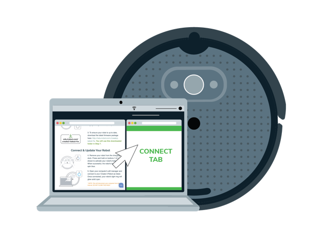  
c)	Navigate to the Connect page on the robot’s webserver and fill in the fields for Wi-Fi network name and password.
Click Connect when done.
  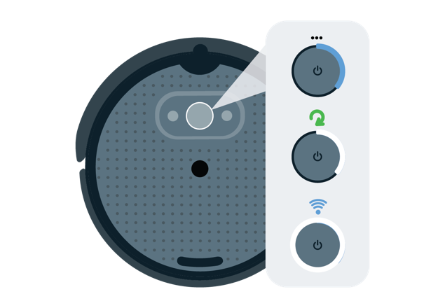  
d)	Your robot's light ring will spin blue when it attempts to connect to Wi-Fi.
The light will transition to solid white and chime its happy sound when successful.
You may now close the browser window connected to the robot.
    
e)	If your Wi-Fi connection fails, as indicated by the light ring glowing another color besides solid white, visit our [troubleshooting page](../../hw/face/#while-connecting-to-wi-fi) to decode your error message.

----

### How do I power the Create® 3 educational robot ON/OFF or enter LOW POWER MODE?
**ON**: To power your Create® 3 robot ON, plug your charging dock in and place the robot on the dock.
    
**OFF**: To power your Create® 3 robot OFF, press and hold the center button for seven (7) seconds.
Its light ring will flash bright white three (3) times and then play the "power down" jingle.
    
**LOW POWER MODE**: To send the Create® 3 robot into LOW POWER MODE, press and hold Button 1 for ten (10) seconds.
When in low power mode, your robot will keep its payload power alive and will be able to charge, but will not respond to Wi-Fi, USB or Bluetooth[^3].
To exit LOW POWER MODE, press and hold the center button for one (1) second.
Please Note: Low Power Mode should not be used for long term storage.
  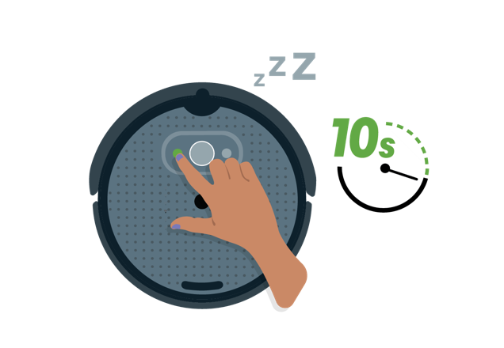  

----

### How do I remove and/or replace the Create® educational 3 robot's faceplate?
Please watch our [instructional video for removing the Create® 3 robot’s faceplate](https://bcove.video/3MjnZWQ).

To **remove** the Create® 3 robot's faceplate, place your thumbs on the turn tabs as shown in the diagram below.
Apply pressure in a counter-clockwise direction.

To **replace** the Create® 3 robot’s faceplate, lightly position the faceplate rotated approximately ten (10) degrees off-center, as shown in the diagram (do not apply downward force).
Place your thumbs on the turn tabs and apply pressure in a clockwise direction.
You should feel the faceplate 'click' into place when centered.

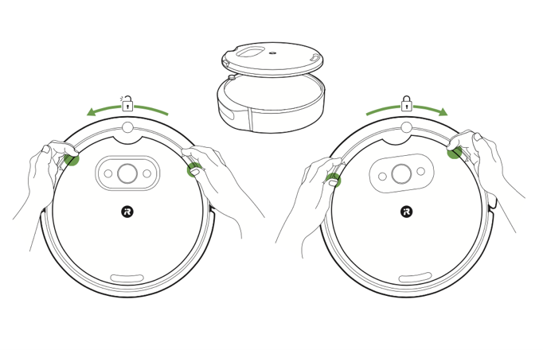

----

### Where can I find an overview of the Create® 3 educational robot’s mechanical system?
You may read about the Create® 3 educational robot’s mechanical system [here](../../hw/mechanical/).

----

### Where can I find an overview of the Create® 3 educational robot’s electrical system?
You may read about the Create® 3 educational robot’s electrical system [here](../../hw/electrical/).

----

### What do the different Create® 3 educational robot’s light messages mean?
The center button on the Create® 3 educational robot contains a ring of six RGB LEDs which communicate state about the robot.
You may read about the Create® 3 educational robot’s light messages and what they mean [here](../../hw/face/).

----

### What do the different Create® 3 educational robot’s buttons do?
The Create® 3 educational robot has three buttons on its top face.
These buttons expose core functionality of the robot but can also be overridden by the user.
  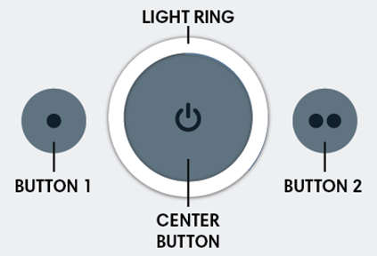  
**Button 1**: Button 1 (to the left of center) is marked with a single dot (•).
If held for ten seconds, the robot will go into "standby" mode, keeping its charging circuitry active, and continuing to power the payload.
The robot can be placed on the dock to charge or to keep the payload alive in this mode.
To wake the robot from standby, hold the center button for one second.
Button presses can be accessed by the user in both ROS 2 and Bluetooth modes.

**Button 2**: Button 2 (to the right of center) is marked with two dots (••).
This button is a user button only.
Button presses can be accessed by the user in both ROS 2 and Bluetooth modes.

**Center Button**: The center button is marked with a power icon.
If held for seven seconds, the robot will go into "storage mode," disconnecting its internal battery from the robot and its payload.
When the robot is in storage mode, the only way to power it on is to place it on the dock.
The button also contains a light ring on its circumference.

----

### How much payload weight can the Create® 3 educational robot carry?
The maximum recommended payload weight (without changing acceleration limits) for the Create® 3 educational robot is 9 kg directly above the center of gravity of the chassis.
The robot can handle more weight with reduced acceleration limits or careful management of the load.

----

### I am familiar with Raspberry Pi®, NVIDIA® Jetson™, or other embedded computers; can I use them with the Create® 3 educational robot?
Yes! [^4] [^5]
The Create® 3 works out of the box with many embedded computers.
They can be connected over a wireless link; if a wired link is required, an appropriate USB cable will need to be purchased.
The robot provides a USB-C host port and access to raw battery voltage.
[A guide to Create® 3 Hookup Examples can be found here.](../../hw/hookup/)

----

### Does the Create® 3 educational robot have any printable accessories?
Yes.
The Create® 3 robot has printable compute board parts, caster parts, generic parts, and sensor mounts parts.
These parts are available under the Printable Accessories subheading of the Hardware menu on this site, accessible from the left context menu.

----

### How do I use the Create® 3 educational robot’s webserver?
The Create® 3 robot runs a configuration webserver for modifying settings of the robot.
You may learn more about the webserver and using it [here](../../webserver/overview/).

----

### Where can I find the latest firmware releases for the Create® 3 educational robot?
Yes. For the latest firmware releases, we invite you to explore the [“Firmware Releases” section of this site](../../releases/overview/).

----

## Tutorials

### Are there any software examples available for the Create® 3 educational robot?
Yes. For more information, we invite you to explore the “Software Examples” section of this site, accessible from the left context menu.

----

### Are there any APIs available for the Create® 3 educational robot?
Yes. There are several APIs available for use with the Create® 3 educational robot, including but not limited to: [ROS 2 Interface](../../api/ros2/), [Moving the Robot](../../api/moving-the-robot/), [Docking](../../api/docking/), [Drive Goals](../../api/drive-goals/), [Hazards](../../api/hazards/), [Odometry](../../api/odometry/), [Reflexes](../../api/reflexes/), [Safety](../../api/safety/), [User Interface](../../api/ui/), and [Wall Follow](../../api/wall-follow/).

----

## Troubleshooting
### How long does the Create® 3 educational robot’s battery normally take to charge?
Charging time for the Create® 3 robot under normal conditions, with no payload(s) attached, is at least 2 hours.

----

### What is the battery run time Create® 3 educational robot?
The battery run time for the Create® 3 robot will vary from user to user and is dependent on how the robot is being used and/or if any payloads are connected.

----

### Can I turn my Create® 3 educational robot into a robot vacuum cleaner?
The Create® 3 educational robot is based on the Roomba® i3 platform but does not include support for Roomba robot brushes, rollers, or vacuum motors.
The bottom plastics and software are completely different than what is on a Roomba i-Series robot, and the robot will not connect to the iRobot Home App.

----

### The battery for my Create® 3 educational robot is not working. Help?
The Create® 3 robot uses a standard Lithium Ion Battery for Roomba® e & i series robots:
- The battery shipping with the robot is a 26 Wh, 4S Lithium Ion smart battery pack, with a nominal voltage of 14.4 V (12 V min, 16.8 V max).
- The battery will report a 0% state of charge when the total voltage of the pack reaches 12.0 V.
- The battery will self-protect and disconnect from any load at 10.8 V or lower.

If the robot is left off the dock to discharge, and it is not powered off explicitly either using the center button or with the Robot Power service, the battery may go into a self-protection mode, which will keep it from charging.

To reset the battery's internal self-protection flag, please follow the steps below:

1. Unscrew the bottom cover from the robot.
2. Remove the battery from the robot.
3. Unplug the adapter board by pulling it out through the rear payload bay hole.
4. After at least fifteen minutes, reinstall the battery and replace the bottom cover; the robot should now charge.

Note: Please allow the robot to fully charge on the dock before using it off the dock and replacing the adapter board.

----

### I need to replace the battery for my Create® 3 educational robot. Where can I buy a new one?
The Create® 3 robot uses a standard Lithium Ion Battery for Roomba® e & i series robots, which may be found [here](https://www.irobot.com/en_US/roomba-accessories/4624864.html).

----

### I need to replace the caster wheels for my Create® 3 educational robot. Where can I buy new ones?
The Create® 3 robot uses the standard Wheel Modules for Roomba® e & i series robots, which may be found [here](https://www.irobot.com/en_US/roomba-wheel-module-bundle-compatible-with-the-i%2C-e%2C-and-j-series./4624872_4624873.html).

----

### I have a Roomba® i3 Series Robot. Can I convert it into a Create® 3 educational robot?
No.
The Roomba® i3 robot does not support ROS 2 or Python.

----

### I need more support on how to use the Create® 3 educational robot. Help?
For questions on troubleshooting specific technical issues, or on using third-party hardware, it is recommended that users post to the [Create® 3 Discussion Forum](https://github.com/iRobotEducation/create3_docs/discussions).

This forum is monitored by Create 3 community members and iRobot volunteers, and will allow additional technical contributors to help resolve this issue.
By posting here, you will also help others troubleshoot their own experiences with the Create 3 robot.
Thank you!

----

### Can you help me with my TurtleBot 4 robot?
Please note that the TurtleBot 4 is a derivative product of iRobot's Create 3 robot made by Clearpath Robotics, by Rockwell Automation.
This product is built with its own separate configuration.
We encourage you to please direct any questions regarding the TurtleBot 4 robot [here](https://github.com/turtlebot/turtlebot4/issues).

----

## Notices and Policies

### Where can I find the product information guide for the Create® 3 educational robot?
The product information guide can be found [here](data/Create-3_Product-Information-Guide.pdf).

----

### Where can I find the warranty policy for the Create® 3 educational robot?
Due to the unique nature of this product, and that most users will alter the product or dismantle it, iRobot will not warrant the product beyond the manufacturing defects and workmanship experienced when first encountering this product upon delivery in the original packaging.
You may read the iRobot® Create® 3 educational robot's full limited warranty within the product information guide [here](data/Create-3_Product-Information-Guide.pdf).

[^1]: ROS 2 is governed by Open Robotics.
[^2]: USB-C® is a trademark of USB Implementers Forum.
[^3]: The Bluetooth® word mark and logos are registered trademarks owned by Bluetooth SIG, Inc. and any use of such marks by iRobot is under license.
[^4]: Raspberry Pi® is a trademark of Raspberry Pi Trading. All other trademarks mentioned are the property of their respective owners.
[^5]: NVIDIA and Jetson are trademarks or registered trademarks of NVIDIA Corporation.
[^6]: All other trademarks mentioned are the property of their respective owners.