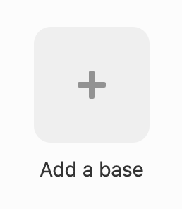
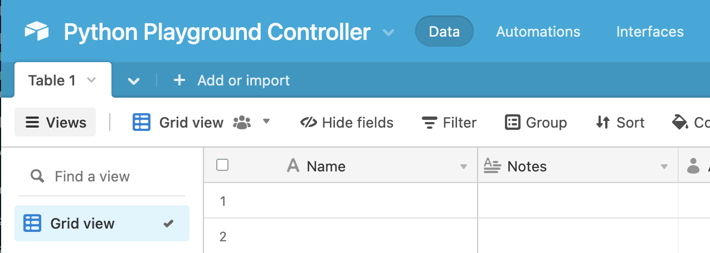
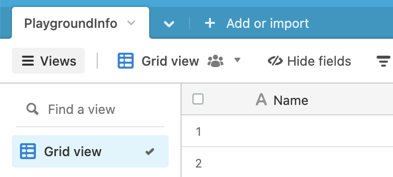
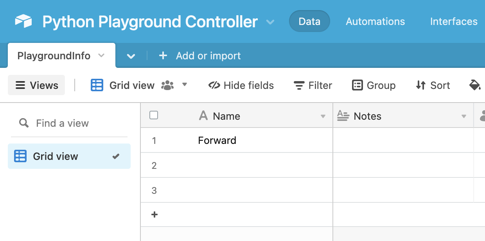
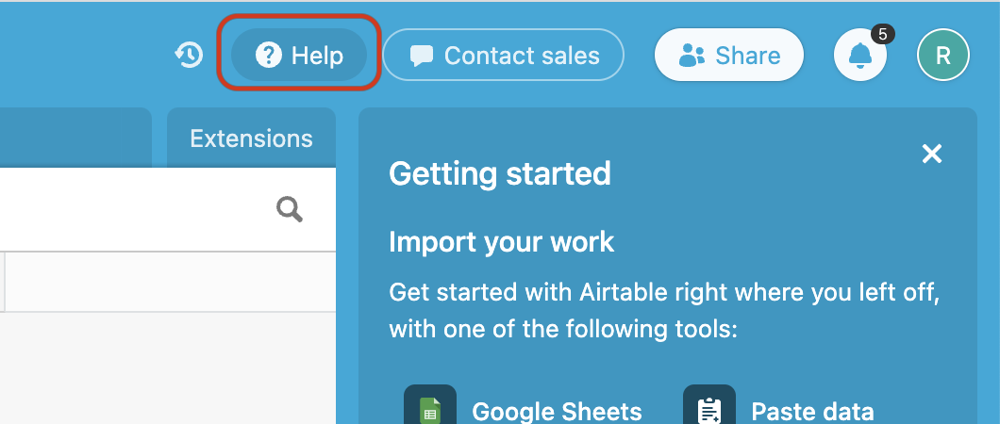
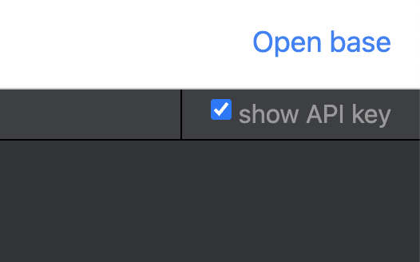

# Integrating AirTable with the Python Web Playground
## Details
Reference resources to support coding in the iRobot Education Python Web Playground.

### Downloads and Resources
* [Link: Python Web Playground](http://python.irobot.com/)
* [Link: Airtable](http://airtable.com/)

## Integrating Airtable into the Python Web Playground
### Setting Up Your Airtable
1. Visit airtable.com and make an account.
1. Create a new Airtable base named "Python Playground Controller"


1. Name the new base's first table "PlaygroundInfo"

1. In cell 1, Type the word "Forward"

1. Navigate to the top-left corner of the page and click "Help"

1. At the bottom, click "API Documentation." This page shows the details for connecting your Airtable base to other connected apps using the REST API. Here, we will gather some unique identifiers for your base so that we can identify it with the Python Playground.

1. Next, navigate to the top-left corner and activate the "Show Your API" option. This will show your account's API Key in the links on the page. Make sure to keep this key private, as it carries the same access as your username/password!

1. Scroll to find your API Key and the curl URL. Save both strings for later.


### Building Your Python Playground Project
1. Open python.irobot.com.
1. Highlight and delete the starter code so you are left with an empty code screen.
1. Copy and paste the below code snippet into the Python Playground. NOTE: The indent formatting may be incorrect on this website. Update your copy & pasted code with the indent spacing shown in the screenshot below in Editing Your Python Playground Project.
```
#
# Licensed under 3-Clause BSD license available in the License file. Copyright (c) 2021 iRobot Corporation. All rights reserved.
#

from irobot_edu_sdk.backend.bluetooth import Bluetooth
from irobot_edu_sdk.robots import event, hand_over, Color, Robot, Root, Create3
from irobot_edu_sdk.music import Note
from pyodide.http import pyfetch

robot = Root(Bluetooth()) # Will connect to the first Root Robot found.
#robot = Create3(Bluetooth()) # Will connect to the first Create Robot found.

@event(robot.when_play)
async def play(robot):
    i = 0 # Debug: just to be sure that the program is iterating properly.
    while True:
    print(i)
    i += 1
  response = await pyfetch('INSERT CURL URL HERE')
  j = await response.json()
  # print(j['records'])
  for record in j['records']:
  print(record) # Debug.
  if record and record['fields']:
  if record['fields']['Name'] == 'Forward':
  print('Forward!')
  await robot.set_wheel_speeds(10, 10)
  elif record['fields']['Name'] == 'Spin':
  print('Spin!')
  await robot.set_wheel_speeds(5, -5)
  elif record['fields']['Name'] == 'Stop':
  print('Stop!')
  await robot.set_wheel_speeds(0, 0)
robot.play()
```

### Editing Your Python Playground Project
1. If you are using the Root Coding Robot, you can leave the template as-is. However, if you are using the Create 3 Educational Robot, change lines 14 and 15 to the following code snippet:
```
#robot = Root(Bluetooth()) # Will connect to the first Root Robot found.
robot = Create3(Bluetooth()) # Will connect to the first Create Robot found.
```
1. Next, copy your Airtable's curl URL and use it to replace the URL inside the single-quotation marks in line 24.


### Playing Your Program
1. Open the Python Playground and your Airtable base side-by-side.
1. Now that your project and database are set up, click "Connect" to pair with your robot. Make sure that your robot is powered on!
1. Press Play to start your project. Because your Airtable entry says "forward," the robot should begin to drive forward.
1. Try controlling your robot by typing Forward, Stop, and Spin into cell 1 in your Airtable!
    * Forward drives the robot forward at 10 cm/s
    * Stop stops your robot's wheels
    * Spin rotates your robot clockwise at 5 cm/s

### Going Further
You can take this project further by integrating your Airtable with other internet-connected tools. For example, on Thunkable.com, you can use drag-and-drop block code to create a mobile app that updates the values in your Airtable. From there, you can turn your phone into a remote control for your robot!