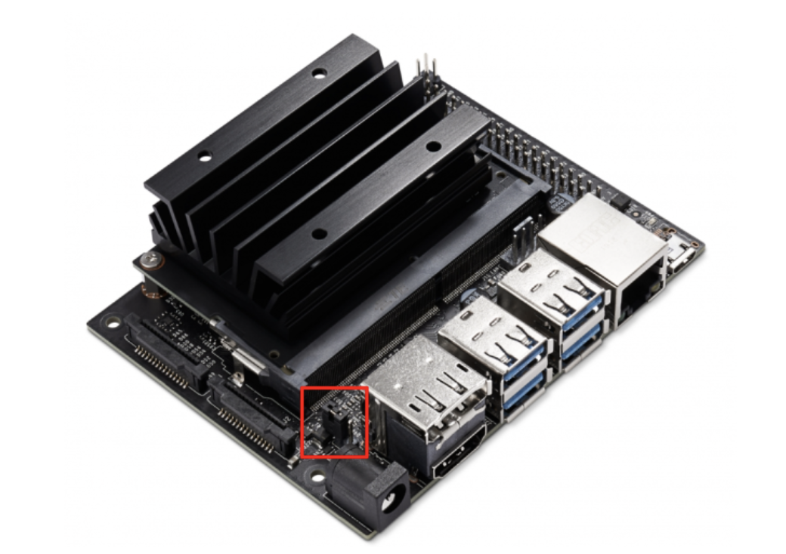

<!--
# SPDX-FileCopyrightText: Copyright (c) 2022 NVIDIA CORPORATION & AFFILIATES. All rights reserved.
# SPDX-FileCopyrightText: Additions copyright (c) 2022 iRobot Corporation. All rights reserved.
# SPDX-License-Identifier: BSD-3-Clause
#
# Redistribution and use in source and binary forms, with or without
# modification, are permitted provided that the following conditions are met:
#
# 1. Redistributions of source code must retain the above copyright notice, this
# list of conditions and the following disclaimer.
#
# 2. Redistributions in binary form must reproduce the above copyright notice,
# this list of conditions and the following disclaimer in the documentation
# and/or other materials provided with the distribution.
#
# 3. Neither the name of the copyright holder nor the names of its
# contributors may be used to endorse or promote products derived from
# this software without specific prior written permission.
#
# THIS SOFTWARE IS PROVIDED BY THE COPYRIGHT HOLDERS AND CONTRIBUTORS "AS IS"
# AND ANY EXPRESS OR IMPLIED WARRANTIES, INCLUDING, BUT NOT LIMITED TO, THE
# IMPLIED WARRANTIES OF MERCHANTABILITY AND FITNESS FOR A PARTICULAR PURPOSE ARE
# DISCLAIMED. IN NO EVENT SHALL THE COPYRIGHT HOLDER OR CONTRIBUTORS BE LIABLE
# FOR ANY DIRECT, INDIRECT, INCIDENTAL, SPECIAL, EXEMPLARY, OR CONSEQUENTIAL
# DAMAGES (INCLUDING, BUT NOT LIMITED TO, PROCUREMENT OF SUBSTITUTE GOODS OR
# SERVICES; LOSS OF USE, DATA, OR PROFITS; OR BUSINESS INTERRUPTION) HOWEVER
# CAUSED AND ON ANY THEORY OF LIABILITY, WHETHER IN CONTRACT, STRICT LIABILITY,
# OR TORT (INCLUDING NEGLIGENCE OR OTHERWISE) ARISING IN ANY WAY OUT OF THE USE
# OF THIS SOFTWARE, EVEN IF ADVISED OF THE POSSIBILITY OF SUCH DAMAGE.
#
-->

# Connect Create® 3 to NVIDIA® Jetson™ and set up ROS 2 Galactic

!!! important
    **This is community-submitted content. Please feel welcome to submit PRs for additions or corrections.**

## Before you start
!!! attention
    **These directions are written for someone with experience with embedded Linux and basic embedded computers.**

Only JetPack 4 is available for the Jetson Nano. It is highly recommended to read through the getting started document for your NVIDIA® Jetson™ developer kit before beginning:

* [Get Started With Jetson Nano Developer Kit]([https://developer.nvidia.com/embedded/learn/get-started-jetson-orin-nano-devkit](https://developer.nvidia.com/embedded/learn/get-started-jetson-nano-devkit))

If running into issues with installing JetPack 4, check the following: 
- The Nano will not power on if the type of power supply you are using for the micro usb is not correct. You should use a 5V 2A block 
- Nano will not turn on if jumper is still attached as such

## Setup Overview

## ROS 2 Setup on Jetson

There are two main methods of installing ROS2 on the Jetson Nano. The primary and recommended method is building from a pre flashed Ubuntu image, and is described below 

### Instructions for flashing Nano with Q Engineering Image

1. Download the image from the github [here](https://github.com/Qengineering/Jetson-Nano-Ubuntu-20-image)
2. Write to the image using the following sources
    
    a. For Mac
    
    - Use [Etcher](https://etcher.balena.io/) 
    
    *Note: if it does not download as a dmg the first time, you may need to redownload*
    
    - Once downloaded, open the application, select the zipped downloaded image, select the SD card, and flash
    
    b. For Windows
    
    - install and launch the [SD Memory Card Formatter for Windows](https://www.sdcard.org/downloads/formatter/sd-memory-card-formatter-for-windows-download/)
    
    - Select card drive and select “Quick format”
    
    - Leave “Volume label” blank
    
    - Click “Format” to start formatting, and “Yes” on the warning dialog

    - Download [Etcher](https://etcher.balena.io/)

    - Select the zipped downloaded image and flash the SD card

    - After Etcher finishes, Windows may let you know it doesn’t know how to read the SD Card. Just click Cancel and remove the microSD card.
3. Insert the SD card into the Jetson, power on your computer display and connect it, connect the USB keyboard and mouse, and connect the provided power supply. The Jetson Orin Nano Developer Kit will power on and boot automatically.
4. Follow the Q Engineering instructions for updating the Ubuntu version found [here](https://qengineering.eu/install-ubuntu-20.04-on-jetson-nano.html)
5. Now, with Ubuntu 20.04 operational, follow the ROS2 guide for building ROS2 from [source](https://docs.ros.org/en/humble/Installation/Alternatives/Ubuntu-Development-Setup.html)

 
## Communication mode 

*Note: use Cyclone DDS over Fast DDS*

### Setup Wi-Fi connections.

#### Create® 3 Wi-Fi setup

Follow the main guide (https://edu.irobot.com/create3-setup) to connect your Create® 3 to your wireless AP.

Once you connect Create® 3 robot to your wireless AP, and find out the new IP address assigned to your robot, you can access the robot web dashboard by the new IP address.

If you plan to operate multiple Create® 3 robots in the same wireless network, it is a good idea to set "ROS 2 Domain ID" on the "Application" > "Configuration" page.

#### Jetson™ Wi-Fi setup

If you have your Jetson connected to a display monitor ("Monitor-attached" Mode), use the Ubuntu's GUI to setup Wi-Fi connection ([official guide](https://help.ubuntu.com/20.04/ubuntu-help/net-wireless-connect.html.en)).

> If you cannot easily attach a display monitor to your Jetson, check [this guide](https://jetbot.org/master/software_setup/wifi_setup.html#headless-mode) for "Headless Mode".

#### Test inside Jetson ROS container

1. Check to ensure Create® 3 topics appear

        ros2 topic list

    You should get

        /battery_state
        /cmd_audio
        /cmd_lightring
        /cmd_vel
        /dock
        /hazard_detection
        /imu
        /interface_buttons
        /ir_intensity
        /ir_opcode
        /kidnap_status
        /mouse
        /odom
        /parameter_events
        /rosout
        /slip_status
        /stop_status
        /tf
        /tf_static
        /wheel_status
        /wheel_ticks
        /wheel_vels

1. Check if it reads a message on a topic

        ros2 topic echo battery_state

    You should see continuous repetition of output like the following.

        header:
          stamp:
            sec: 1683568887
            nanosec: 488023084
          frame_id: ''
        voltage: 16.56999969482422
        temperature: 36.95000076293945
        current: 0.5609999895095825
        charge: 2.075000047683716
        capacity: 2.1500000953674316
        design_capacity: 2.1500000953674316
        percentage: 0.9700000286102295
        power_supply_status: 0
        power_supply_health: 0
        power_supply_technology: 0
        present: true
        cell_voltage: []
        cell_temperature: []
        location: ''
        serial_number: ''
        ---       

### Set up Ethernet over USB

!!! Attention
    If you chose and performed the above "***Setup Wi-Fi connections***", you can skip this section.

If you need a reliable wired communication between Create® 3 and Jetson™, you can connect them via a USB cable and let them establish a virtual Ethernet connection over the USB data communication.

Jetson's upstream USB port (USB-C for the case of Jetson Orin Nano Developer Kit and Micro B for the case of Jetson Xavier Developer Kit) is conveniently set up in such a way to present a virtual network card to the host system, so Create® 3 and Jetson can form a virtual Ethernet connection over the USB link.

However, because Create® 3 expects the client device to have a specific IP address (`192.168.186.3`), we need to tweak the Jetson's "USB Device Mode" functionality, that is designed to run a DHCP server on Jetson side to assign IP address to other device by default.

#### Alter "USB Device Mode" to apply static IP

1. To alter the Jetson's "USB Device Mode" feature (specifically, disabling DHCP server and self-assign a static IP address);

    1. First, create a flag file to store IP address for Jetson to be used with Create® 3.

            sudo bash -c 'echo "192.168.186.3" > /opt/nvidia/l4t-usb-device-mode/IP_ADDRESS_FOR_CREATE3_ROBOT.conf'

    2. Then, modify the "nv-l4t-device-mode-runtime" service script (`/opt/nvidia/l4t-usb-device-mode/nv-l4t-usb-device-mode-runtime-start.sh`). The complete file is [here](data/nv-l4t-usb-device-mode-runtime-start.sh).
      

2. Connect USB cable from Create® 3 robot to the upstream USB port of Jetson. Then check if the static IP address is set by issuing `ifconfig` command.

        $ ifconfig l4tbr0

        l4tbr0: flags=4163<UP,BROADCAST,RUNNING,MULTICAST>  mtu 1500
                inet 192.168.186.3  netmask 255.255.255.0  broadcast 192.168.186.255
                inet6 fe80::1  prefixlen 128  scopeid 0x20<link>
                inet6 fe80::ecb6:edff:feac:7dd5  prefixlen 64  scopeid 0x20<link>
                ether ee:b6:ed:ac:7d:d5  txqueuelen 1000  (Ethernet)
                RX packets 169  bytes 36206 (36.2 KB)
                RX errors 0  dropped 0  overruns 0  frame 0
                TX packets 1644  bytes 213306 (213.3 KB)
                TX errors 0  dropped 0 overruns 0  carrier 0  collisions 0

    !!! warning
        Be sure that the [USB/BLE toggle on the robot's adapter board](../../hw/electrical/#adapter-board-overview) is set to the USB position.

3. Check if you can ping Create® 3 robot

        ping 192.168.186.2

    !!! note
        If you ever want to stop using the Jetson device for Create® 3 and re-enable the original USB Device Mode feature (so that you can connect to your Windows PC in headless style), you can simply remove the flag file, or execute the following.

        sudo mv /opt/nvidia/l4t-usb-device-mode/IP_ADDRESS_FOR_CREATE3_ROBOT.conf /opt/nvidia/l4t-usb-device-mode/IP_ADDRESS_FOR_CREATE3_ROBOT.conf.bak

#### Test the USB link inside the container

1. Set the `ROS_DOMAIN_ID` environmental variable 

    Once you are in container;

        export ROS_DOMAIN_ID=32

1. Set the default network interface by setting Cyclone DDS configuration.

        export CYCLONEDDS_URI='<CycloneDDS><Domain><General><NetworkInterfaceAddress>l4tbr0</NetworkInterfaceAddress></General></Domain></CycloneDDS>'

1. Check to ensure Create® 3 topics appear

        ros2 topic list

    You should get

        /battery_state
        /cmd_audio
        /cmd_lightring
        /cmd_vel
        /dock
        /hazard_detection
        /imu
        /interface_buttons
        /ir_intensity
        /ir_opcode
        /kidnap_status
        /mouse
        /odom
        /parameter_events
        /rosout
        /slip_status
        /stop_status
        /tf
        /tf_static
        /wheel_status
        /wheel_ticks
        /wheel_vels

1. Check if it reads a message on a topic

        ros2 topic echo battery_state

    You should see continuous repetition of output like following.

        header:
          stamp:
            sec: 1683568887
            nanosec: 488023084
          frame_id: ''
        voltage: 16.56999969482422
        temperature: 36.95000076293945
        current: 0.5609999895095825
        charge: 2.075000047683716
        capacity: 2.1500000953674316
        design_capacity: 2.1500000953674316
        percentage: 0.9700000286102295
        power_supply_status: 0
        power_supply_health: 0
        power_supply_technology: 0
        present: true
        cell_voltage: []
        cell_temperature: []
        location: ''
        serial_number: ''
        ---       
